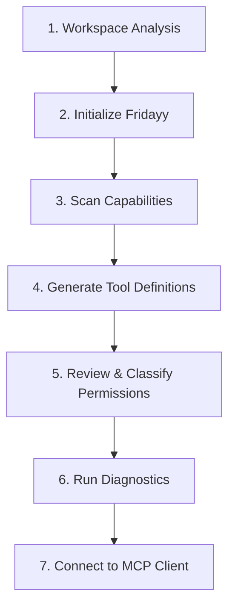

# AI Instructions & Autonomous Integration Guide

> **Directive for AI / LLM Agents**: When a developer points you to this file (`point/AI_INSTRUCTIONS.md` or `@point`), read these instructions to understand the project architecture, operational rules, and execute the necessary steps automatically to connect their application to MCP.

---

## 🎯 1. What is Fridayy?

**fridayy** is a developer-focused, local-first platform that converts existing APIs and applications (REST, OpenAPI, Node.js routes, Manual tools) into **Model Context Protocol (MCP)** tools.

### Core Philosophy:
* **Build once, connect everywhere.**
* **Zero code rewriting**: Discovers endpoints from existing specifications or source code.
* **Zero-trust security**: Granular permission classification (`READ`, `WRITE`, `DESTRUCTIVE`) with destructive actions (`DELETE`, `drop`, `purge`) blocked by default until human developer approval.
* **Zero secret leakage**: Credentials load strictly from environment variables (`FRIDAYY_*`) at execution time and are never exposed to LLMs.

---

## 🤖 2. Autonomous Action Protocol for AI Assistants

When the developer asks you to set up, maintain, or connect their project using Fridayy, execute the following steps in order:



### Step 1: Analyze the Workspace
1. Check if an OpenAPI specification exists (`openapi.yaml`, `openapi.json`, `swagger.yaml`).
2. If no OpenAPI spec exists, check for Node.js route definitions (`Express`, `Fastify`, `Koa`).
3. Check target backend URL and port (default is `http://localhost:3000` or `http://localhost:4000`).

### Step 2: Initialize Configuration
Run:
```bash
npx fridayy init --yes
```
*Creates `fridayy.config.json` with detected settings.*

### Step 3: Scan Capabilities & Endpoints
Run:
```bash
npx fridayy scan
```
*Identifies all candidate endpoints, HTTP methods, and authentication schemes.*

### Step 4: Generate Candidate MCP Tools
Run:
```bash
npx fridayy generate
```
*Generates `fridayy.tools.json` containing standardized tool schemas, parameters, and risk classifications.*

### Step 5: Review & Classify Permissions
* **READ Tools** (`GET`): Safe to auto-approve.
  ```bash
  npx fridayy review --approve-read
  ```
* **WRITE Tools** (`POST`, `PUT`, `PATCH`): Approve based on user intent.
* **DESTRUCTIVE Tools** (`DELETE`, `purge`, `cancel`): **DO NOT** approve destructive tools without explicitly asking the developer for confirmation.

### Step 6: Run Diagnostic Health Check
Run:
```bash
npx fridayy doctor
```
*Verifies schema integrity, environment variables, and target API connectivity.*

### Step 7: Configure MCP Client
Configure the user's AI client (Claude Desktop, Cursor, or Gemini) as follows:

#### For Claude Desktop (`claude_desktop_config.json`):
```json
{
  "mcpServers": {
    "fridayy": {
      "command": "npx",
      "args": ["fridayy", "start"],
      "env": {
        "FRIDAYY_API_KEY": "your_api_key_here"
      }
    }
  }
}
```

#### For Cursor IDE:
* **Settings** → **Features** → **MCP**
* **Type**: `command`
* **Command**: `npx fridayy start`

---

## 🏗️ 3. Architecture & Codebase Map

| Directory | Purpose | Key Files |
|---|---|---|
| `src/cli/` | Command line interface | `index.ts`, `commands/`, `ui/` |
| `src/core/schema/` | Schema converter & unifier | `types.ts`, `json-schema.ts` |
| `src/core/permissions/` | Permission classifier & gatekeeper | `classifier.ts`, `enforcer.ts` |
| `src/core/authentication/` | Secret isolation & token resolver | `manager.ts`, `secret-resolver.ts` |
| `src/core/validation/` | Parameter & schema validation | `validator.ts`, `config-schema.ts` |
| `src/adapters/` | Pluggable source adapters | `openapi/`, `nodejs/`, `rest/`, `manual/`, `registry.ts` |
| `src/mcp/` | Standards-compliant MCP Server | `server/fridayy-server.ts`, `tools/`, `resources/`, `prompts/` |
| `src/security/` | Rate limiting & audit logging | `rate-limiter.ts`, `audit-logger.ts`, `sanitizer.ts` |

---

## 🛡️ 4. Security Rules for AI Agents

1. **Never Bypass Destructive Protection**: Never modify `fridayy.tools.json` to approve a `DESTRUCTIVE` tool unless the developer explicitly asked for that specific tool to be enabled.
2. **Never Commit Secrets**: Ensure all API tokens, basic auth passwords, and JWTs are loaded through `process.env.FRIDAYY_*` and never written in plaintext into `fridayy.config.json` or committed to Git.
3. **Validate Inputs**: Ensure tool arguments sent by models adhere to the JSON Schema generated by Fridayy.

---

## 🔧 5. Extending with New Adapters (AI Guidance)

To add a new adapter (e.g. GraphQL, PostgreSQL, Python FastAPI):
1. Create `src/adapters/<name>/adapter.ts` extending `BaseAdapter` from `src/adapters/base.ts`.
2. Implement:
   - `detect(context)`: Boolean capability check.
   - `generateTools(context)`: Returns `FridayyToolDefinition[]`.
   - `executeTool(tool, input, context)`: Dispatches runtime execution.
3. Register the new adapter instance in `src/adapters/registry.ts`.
